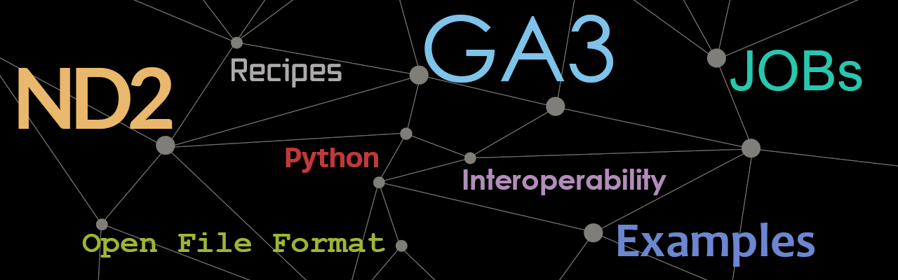

## Find resources

Using [NIS-Elements](https://www.nis-elements.cz/en)? Want to integrate with open source solution? Need examples to make better GA3 and JOBS recipes? 

See these repos:

- [GA3 examples](https://github.com/Laboratory-Imaging/GA3-examples-private)
- [JOBS examples](https://github.com/Laboratory-Imaging/JOBS-examples-private)

## Coming soon...
- ND2 file format specifications
